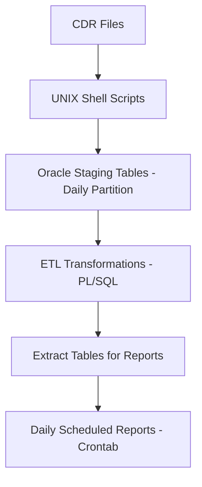
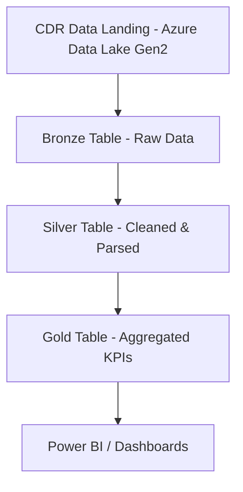

# Modernizing Telecom ETL with Delta Lake and Azure Databricks Unity Catalog

📡 A portfolio project that modernizes a traditional telecom ETL pipeline using Azure Databricks, Delta Lake, and Unity Catalog. This project demonstrates the transition from legacy batch processing on Oracle and UNIX shell scripts to a scalable and auditable medallion architecture using Delta Lake.

## 🚀 Project Objective

Modernize a legacy telecom ETL system that processed daily Call Detail Records (CDRs) from mobile voice, SMS, and data usage. The original process used Oracle staging tables with UNIX shell scripts for batch loads and daily reports. The goal is to re-architect it using:

- Azure Databricks with Unity Catalog
- Delta Lake with Medallion Architecture (Bronze, Silver, Gold)
- Optimized data pipelines with schema evolution, versioning, and time travel

## 🏗️ Architecture Overview

### 🧱 Legacy ETL Architecture



### 🌐 Modern ETL with Delta Lake and Unity Catalog



## 🧪 Dataset Simulated

- Sample CDR files generated in CSV format with fields:
  - `call_type` (voice/sms/data)
  - `start_time`, `duration`, `cell_id`, `msisdn`, `cost`
  - Partitioned by date

## 🛠️ Features Implemented

| Feature | Description |
|--------|-------------|
| 🔄 Legacy Migration | Rewrote PL/SQL transformations into PySpark |
| 🪞 Medallion Architecture | Bronze (raw), Silver (cleaned), Gold (aggregated) |
| 🔍 Schema Evolution | Automatically handled schema changes in evolving CDR structure |
| 🕒 Time Travel | Restored previous versions of Delta tables |
| 🧾 Auditing | Enabled Unity Catalog for fine-grained access control and lineage |
| 📊 Visualization | Country/cell-level summaries and trends with notebooks and Power BI |

## 📂 Directory Structure

```
.
├── notebooks/
│   ├── 01_bronze_ingest.py
│   ├── 02_silver_transform.py
│   ├── 03_gold_aggregate.py
│   ├── 04_visualization.ipynb
├── data/
│   └── sample_cdr_data/
├── diagrams/
│   ├── legacy_etl_mermaid.md
│   ├── modern_etl_mermaid.md
├── README.md
└── requirements.txt
```

## ⚙️ Technologies Used

- **Azure Databricks (Unity Catalog)**
- **Delta Lake**
- **Azure Data Lake Gen2**
- **PySpark**
- **Power BI / Matplotlib / Seaborn**
- **Mermaid.js for diagrams**

## 📊 Sample KPIs Generated

- Daily and monthly total call minutes
- Data consumption trends by region
- Top revenue-generating customers
- Call drop rate by cell tower

## 🧠 Learning Outcomes

- Migrating legacy ETL logic into modern Spark-based workflows
- Implementing reliable, scalable Delta Lake architecture
- Leveraging Unity Catalog for governance and access management
- Monitoring and auditing historical versions of the data

## 📌 How to Run

1. Clone the repo:
   ```bash
   git clone https://github.com/<your-username>/Modernizing-Telecom-ETL-with-Delta-Lake-and-Azure-Databricks-Unity-Catalog.git
   ```

2. Upload sample data to your ADLS Gen2 container.

3. Open the Databricks notebooks in the `notebooks/` directory in order.

4. Explore results in Power BI or notebook visualizations.

## 📬 Contact

If you found this project helpful or want to collaborate, feel free to connect:

- 💼 LinkedIn: Ayub Khan https://www.linkedin.com/in/ayub-khan-85073556/
- 📧 Email: khanayubchand@gmail.com

## 📃 License

This project is licensed under the MIT License - see the [LICENSE](LICENSE) file for details.
